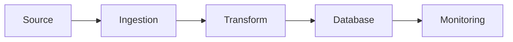

# Data Engineering and Database Administration Platform

## Overview

Production-grade platform combining Data Engineering, DBA, and SRE practices.

## Tech Stack
- Python, SQL
- PostgreSQL, MySQL
- Terraform, Ansible
- AWS, Azure

## Architecture

## Structure

etl/
database/
cloud/
monitoring/
infrastructure/
docs/

## Run

python data_engineering/ingestion/ingest_api_data.py

## Use Cases
- ETL pipelines
- Performance tuning
- Cloud DB ops
