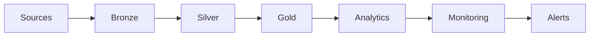

# Principal Database Engineer | Cloud Data Architect | SRE

Production-grade Unified Data Platform Blueprint combining Data Engineering, Advanced DBA, and SRE practices.


---

## Why this Repo

This repository demonstrates how to design and operate real production-grade data systems:

- VLDB systems (>100 TB)
- Multi-region HA/DR architectures
- Zero-downtime migrations
- Automation-first engineering
- Performance and cost optimization

---

## Architecture (Medallion Framework)



---

## Core Capabilities

### Data Engineering
- Medallion architecture (Bronze/Silver/Gold)
- dbt-based transformations
- dlt ingestion pipelines

### Database Engineering
- Partitioning and indexing strategies
- Query optimization and tuning
- Replication and HA setups

### Platform Engineering
- Terraform infrastructure modules
- Kubernetes deployments
- Docker-based local sandbox

### Observability & SRE
- Pipeline freshness tracking
- Schema drift detection
- Data contracts and validation

---

## Run Locally

```bash
cd data-platform/docker
docker-compose up
```

---

## Projects

- Retail ETL pipeline
- Oracle to PostgreSQL migration
- HA/DR deployments
- Storage benchmarking

---

## Why Engineers Star This Repo

- Production-grade architecture
- Covers Data + DBA + SRE together
- Real-world engineering patterns

---

## CI/CD

GitHub Actions configured for testing and validation.

---

## Contributing

Pull requests are welcome.
