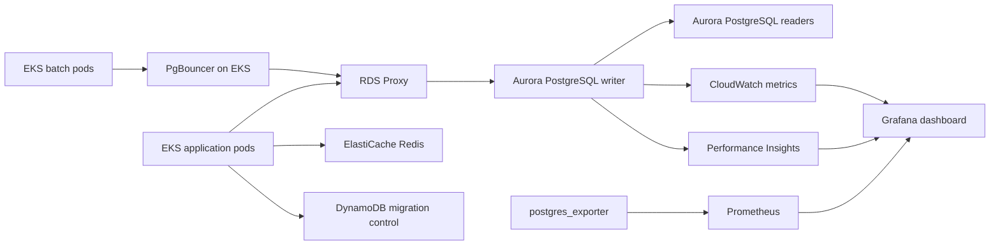

# Aurora PostgreSQL DBRE Framework

This bundle turns the repository into a focused **Aurora PostgreSQL reliability engineering framework** for AWS platform teams that own Aurora, RDS Proxy, DynamoDB, ElastiCache Redis, EKS connection pooling, and production observability.

## Design choices that shape the framework

- **Aurora PostgreSQL 16-first**: the Terraform defaults target Aurora PostgreSQL 16 and enable parameter-group settings that matter for DBRE work such as `pg_stat_statements`, connection logging, and `track_io_timing`.
- **RDS Proxy before hand-rolled pooling for application traffic**: AWS recommends connection pooling to control churn, preserve database headroom, and survive failover without client storms. The framework uses RDS Proxy as the primary application entry point and PgBouncer in EKS for session shedding and local fan-in when pods spike.
- **Transaction pooling in PgBouncer**: the Kubernetes manifests use `pool_mode=transaction`, PodDisruptionBudget coverage, and explicit readiness/liveness probes so the pool behaves predictably during EKS node drains and rolling updates.
- **Observability anchored in exporter metrics, CloudWatch, and Performance Insights**: the dashboard and alerts focus on connection saturation, blockers, long transactions, replication lag, autovacuum debt, and correlate with AWS-native signals instead of pretending Prometheus alone is enough.
- **Zero-downtime DDL guardrails**: the SQL bundle bakes in `lock_timeout`, `CREATE INDEX CONCURRENTLY`, `NOT VALID`/`VALIDATE CONSTRAINT`, and fillfactor/HOT checks because those patterns materially reduce lock risk on busy Aurora writers.
- **DynamoDB kept purpose-built**: the included table is intentionally access-pattern driven for migration coordination and cutover metadata instead of a generic relational mirror.

## Folder map

```text
aurora-postgresql-dbre/
|-- automation/
|   |-- generate_pgbouncer_scram.py
|   |-- run_sql_bundle.ps1
|   `-- run_sql_bundle.sh
|-- docs/
|   `-- architecture.md
|-- infrastructure/
|   `-- terraform/
|       |-- live/
|       |   `-- production/
|       |       |-- main.tf
|       |       |-- outputs.tf
|       |       |-- variables.tf
|       |       `-- versions.tf
|       `-- modules/
|           |-- aurora_postgresql/
|           |   `-- main.tf
|           |-- dynamodb/
|           |   `-- main.tf
|           |-- elasticache_redis/
|           |   `-- main.tf
|           `-- rds_proxy/
|               `-- main.tf
|-- kubernetes/
|   |-- pgbouncer/
|   |   `-- pgbouncer.yaml
|   `-- postgres-exporter/
|       `-- postgres-exporter.yaml
|-- observability/
|   |-- grafana/
|   |   `-- aurora-postgresql-overview.json
|   `-- prometheus/
|       `-- aurora-postgresql-alerts.yaml
`-- sql/
    `-- aurora_postgresql/
        |-- 00_enable_pg_stat_statements.sql
        |-- 10_lock_tracing.sql
        |-- 20_bloat_and_hot_analysis.sql
        |-- 30_statement_latency_percentiles.sql
        `-- 40_zero_downtime_ddl_patterns.sql
```

## How the pieces fit



## Safe rollout order

1. Apply the Terraform stack in `infrastructure/terraform/live/production`.
2. Create the Kubernetes ConfigMaps and Secrets referenced by the manifests.
3. Deploy PgBouncer and `postgres_exporter` to EKS.
4. Run the SQL bundle with `automation/run_sql_bundle.sh` or `automation/run_sql_bundle.ps1`.
5. Import the Grafana dashboard and apply the Prometheus rule file.

## Intentional non-goals

- No static secrets are committed; the manifests consume Kubernetes Secrets and the Terraform stack relies on AWS-managed or caller-supplied credentials.
- No cluster-specific subnet IDs, security-group IDs, ARNs, or endpoints are hard-coded; those belong to each environment.
- No unsafe automatic failover commands are included; operational scripts focus on inspection and guardrails, not forced control-plane actions.
