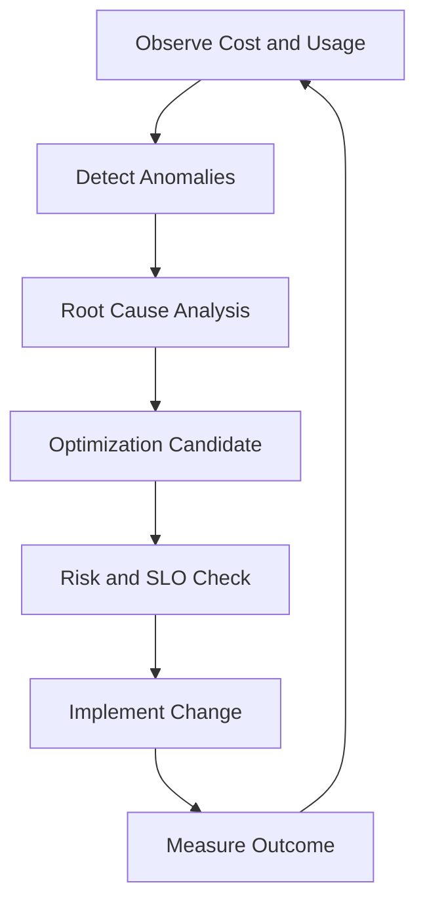

# Capacity and FinOps Operating Standard

This standard defines how database teams forecast growth, prevent reliability regressions, and control cost without sacrificing SLO outcomes.

## Scope

- All production database platforms
- All service tiers with explicit SLOs
- New and existing workloads

## Core Principles

1. Reliability before optimization, optimization before overprovisioning
2. Capacity decisions must be tied to workload shape and SLO targets
3. Cost changes require measurable performance impact validation
4. Forecasting must include storage, compute, memory, and I/O dimensions

## Mandatory Metrics

Track at minimum:

- Utilization:
  - CPU, memory, storage, IOPS, network throughput
- Demand:
  - TPS/QPS, concurrency, read/write ratio, peak windows
- Reliability:
  - p95/p99 latency, error rate, saturation indicators
- Cost:
  - spend by environment, engine, and service owner
  - unit economics (cost per million queries / per GB / per transaction)

## Capacity Planning Process

## Step 1: Baseline

- Capture 8-12 weeks of workload and performance data.
- Identify periodicity (daily/weekly/monthly peaks).

## Step 2: Forecast

- Build demand forecast by service tier.
- Include seasonality and known business events.
- Run conservative and aggressive scenarios.

## Step 3: Test Limits

- Perform controlled load tests for critical paths.
- Determine safe operating envelope and headroom thresholds.

## Step 4: Plan Changes

- Choose scale-up, scale-out, partitioning, or query/index optimization path.
- Score each option on risk, cost, and operational complexity.

## Step 5: Validate and Iterate

- Re-measure performance and cost after change.
- Update forecast model with observed deltas.

## Prescriptive Decision Guardrails

- Keep sustained CPU under 65-70% for Tier-1 OLTP workloads.
- Keep storage utilization below 75% with alerting at 70%.
- Trigger investigation when p99 latency degrades >20% week-over-week.
- Do not downsize compute solely based on average utilization; verify peak behavior and failover capacity.

## FinOps Workflow

Diagram description: Capacity and cost optimization is a continuous loop; each optimization must pass a reliability risk check before implementation.

## Practical Optimization Playbook

Preferred sequence:

1. Query and index tuning
2. Storage/layout optimization (compression, partitioning)
3. Workload scheduling and throttling
4. Right-sizing compute
5. Architectural redesign if required

Why this order:

- It reduces spend with lower operational risk.
- It avoids masking inefficient query patterns with expensive hardware.

## Example Monthly Capacity Review Agenda

1. SLO attainment review
2. Demand and growth forecast updates
3. Cost anomaly review
4. Optimization outcomes and regressions
5. Next month actions (owner and due date)

## Automation Recommendations

- Automated weekly growth projections with confidence bands
- Alerting on abnormal cost per transaction
- Policy checks in CI/CD for risky instance class downgrades
- Auto-generated capacity review report per platform

## Evidence and Governance

Each capacity or cost change should produce:

- Decision record (option analysis + chosen path)
- Performance baseline and post-change comparison
- Cost baseline and post-change comparison
- Risk acceptance and rollback plan

## Review Cadence

- Monthly operational review
- Quarterly strategy review with platform and finance stakeholders
- Immediate review after major traffic shifts or incidents
