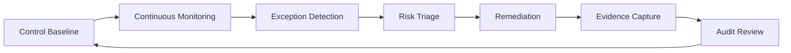

# Security and Compliance Operating Standard

This standard defines mandatory controls for production database estates across on-prem, hybrid, and cloud platforms.

## Scope

- Applies to Tier-1, Tier-2, and Tier-3 data services
- Applies to managed and self-managed engines
- Complements platform-specific security guides in engine folders

## Core Principles

1. Least privilege by default
2. Encryption in transit and at rest
3. Immutable audit trails for privileged actions
4. Continuous control verification, not annual-only checks
5. Operational runbooks must include security checkpoints

## Control Baseline

## 1) Identity and Access Management

- Enforce centralized identity integration where available (IAM/AAD/SSO).
- Prohibit long-lived shared admin credentials.
- Require break-glass account controls:
  - MFA
  - Justification ticket
  - Session recording where supported
  - Automatic expiry

Minimum review cadence:

- Privileged roles: monthly
- Service accounts: quarterly
- Inactive users: immediate deprovisioning after HR signal

## 2) Data Protection

- In transit:
  - TLS required for all application and admin connections
  - Reject non-encrypted client connections in production
- At rest:
  - Enable provider-managed or customer-managed keys
  - Rotate keys per policy and validate decrypt path
- Backups:
  - Encrypt backups and replica snapshots
  - Restrict restore permissions to controlled roles

## 3) Audit and Logging

- Enable query/activity auditing for privileged operations.
- Ensure logs are forwarded to immutable centralized storage.
- Define retention by compliance class (for example 365 days, 7 years).
- Alert on high-risk actions:
  - Privilege escalation
  - Authentication bypass attempts
  - Audit disabled events

## 4) Configuration Hardening

- Disable insecure defaults and test/dev sample users.
- Restrict network access to approved source ranges.
- Enforce version compatibility and patch policy.
- Maintain approved baseline configuration by engine class.

## 5) Vulnerability and Patch Management

- Risk-tier patch SLAs:
  - Critical CVE: <= 7 days (or compensating control documented)
  - High CVE: <= 30 days
  - Medium/Low: aligned to monthly maintenance cycle
- Use canary deployment patterns for engine upgrades.
- Document rollback path before patching.

## Operational Integration Requirements

Every major runbook must include:

- Access prerequisites
- Security impact check
- Evidence capture checklist
- Post-change access review (if roles or secrets changed)

## Evidence Model for Audit Readiness

Collect and retain for each control cycle:

1. Access review records
2. Key rotation records
3. Patch evidence and exception approvals
4. Audit log integrity checks
5. Incident response evidence for security incidents

## Security Operations Workflow



Diagram description: Controls are continuously monitored, exceptions are triaged and remediated, evidence is captured for audit, and outcomes feed baseline refinement.

## Practical Control Checks

### PostgreSQL example (role and password policy review)

```sql
SELECT rolname, rolsuper, rolcreaterole, rolcreatedb, rolcanlogin
FROM pg_roles
ORDER BY 1;
```

### SQL Server example (high-privilege principals)

```sql
SELECT p.name, p.type_desc, r.name AS role_name
FROM sys.database_role_members drm
JOIN sys.database_principals r ON drm.role_principal_id = r.principal_id
JOIN sys.database_principals p ON drm.member_principal_id = p.principal_id
WHERE r.name IN ('db_owner', 'db_securityadmin');
```

## Exceptions and Compensating Controls

- Exceptions must be time-bound and approved by service owner plus security owner.
- Compensating controls must be explicit, testable, and monitored.

## Review Cadence

- Quarterly standard review by DBRE + Security Engineering
- Immediate update after major incidents or regulatory changes
