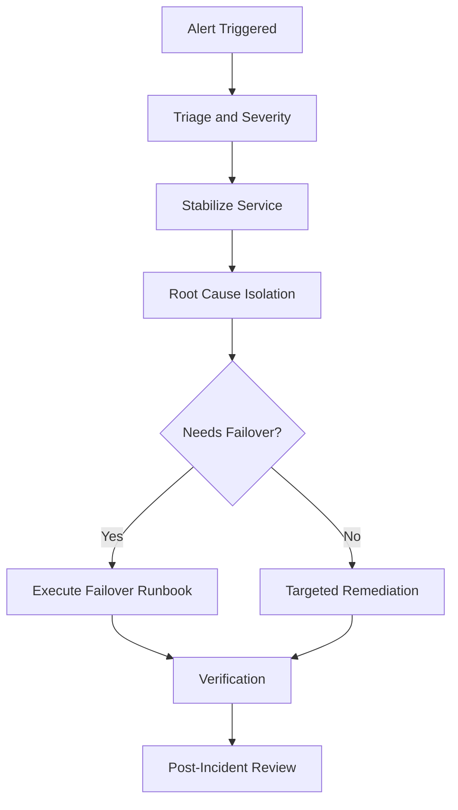

# Incident Runbooks Index

This page is the entry point for incident response procedures.

## Canonical Runbooks

- PostgreSQL Incident Response:
	- `database_admin/sre/runbooks/incident_response.md`
- Failover Procedure:
	- `database_admin/sre/runbooks/failover_procedure.md`
- Disaster Recovery:
	- `database_admin/sre/runbooks/disaster_recovery.md`

## Standard Format

All runbooks should follow the template:

- `database_admin/templates/runbook_template.md`

Required sections include Summary, Impact, Preconditions, Preparation, Procedure, Verification, Rollback, Communication, and Evidence.

## Incident Workflow (Conceptual)

Diagram description: The workflow starts with alerting, moves through triage and stabilization, branches to failover when needed, and converges on verification and post-incident learning.
